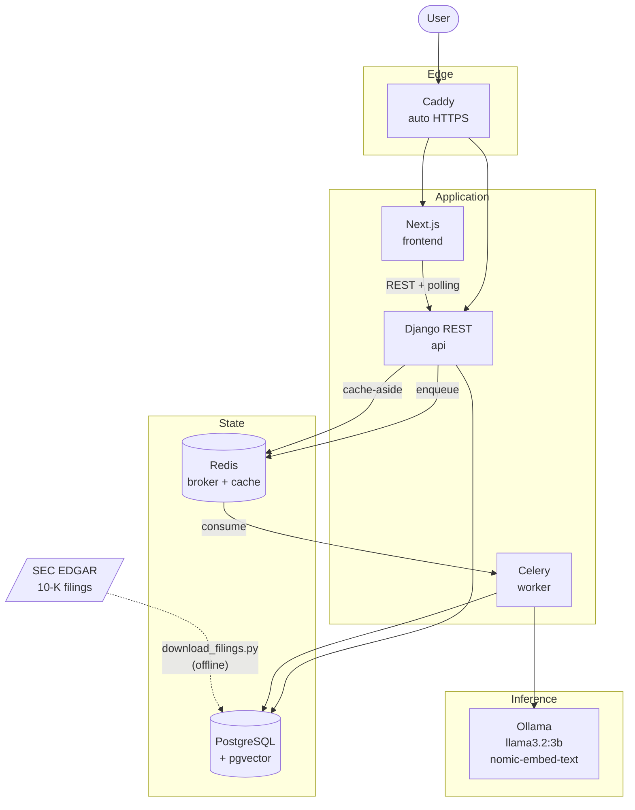
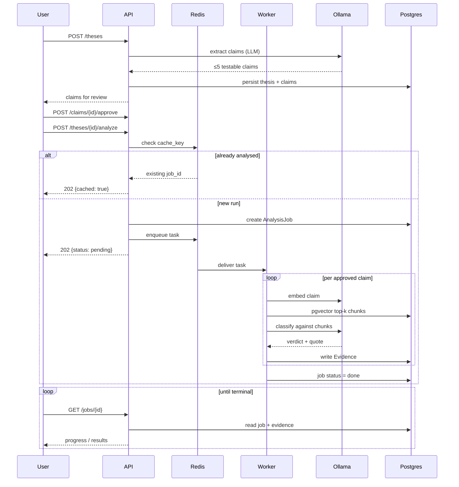
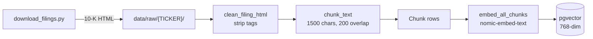
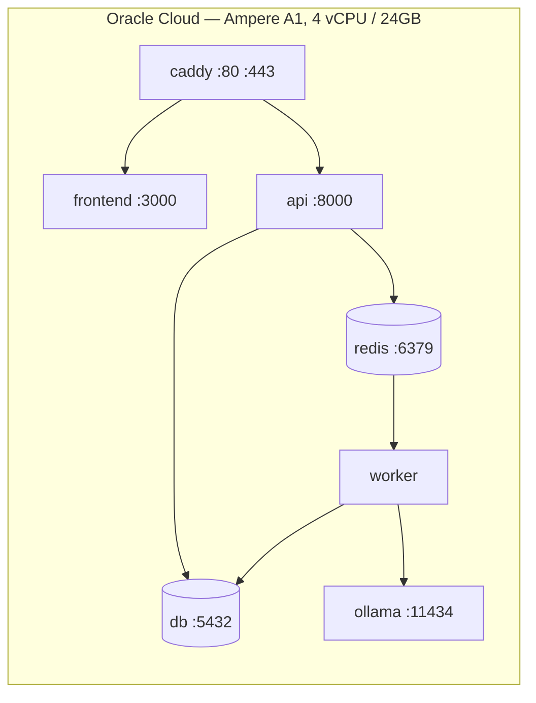

# ThesisLedger — Architecture

## System overview

## Analysis flow

What happens when a user submits a thesis.

## Ingestion (offline)

Runs once per corpus refresh, not per request.

## Why these pieces

| Choice | Reason |
|---|---|
| **Celery + Redis** | Analysis takes minutes on CPU inference. A synchronous request would time out, so the API returns a job id and the frontend polls. |
| **pgvector, not a separate vector DB** | The corpus is ~6k chunks. A second datastore would be operational overhead for no gain, and evidence rows need to join to chunks anyway. |
| **Redis cache-aside** | The same thesis on the same company is deterministic. Re-running costs minutes of CPU, so the job id is cached and returned immediately. |
| **Ollama, self-hosted** | No API key or per-token cost, and the whole stack runs on one Always Free VM. `LLM_PROVIDER` allows swapping to Groq if CPU inference proves too slow. |
| **Quote verification** | A verdict other than `insufficient_evidence` must carry a quote found verbatim in its chunk. If the check fails the row is downgraded rather than emitting a fabricated citation. |

## Deployment

Single VM, Docker Compose. `kind` manifests in `k8s/` exist to demonstrate
horizontal worker scaling, not as the production target.

